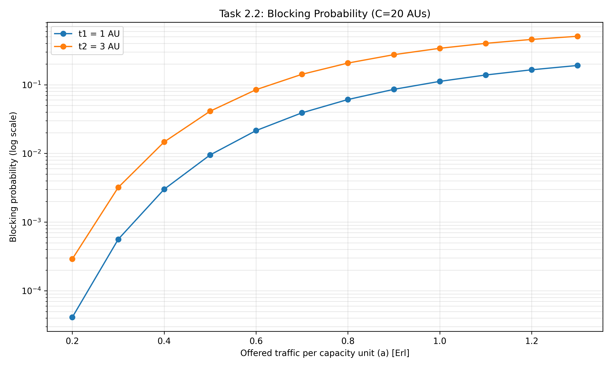
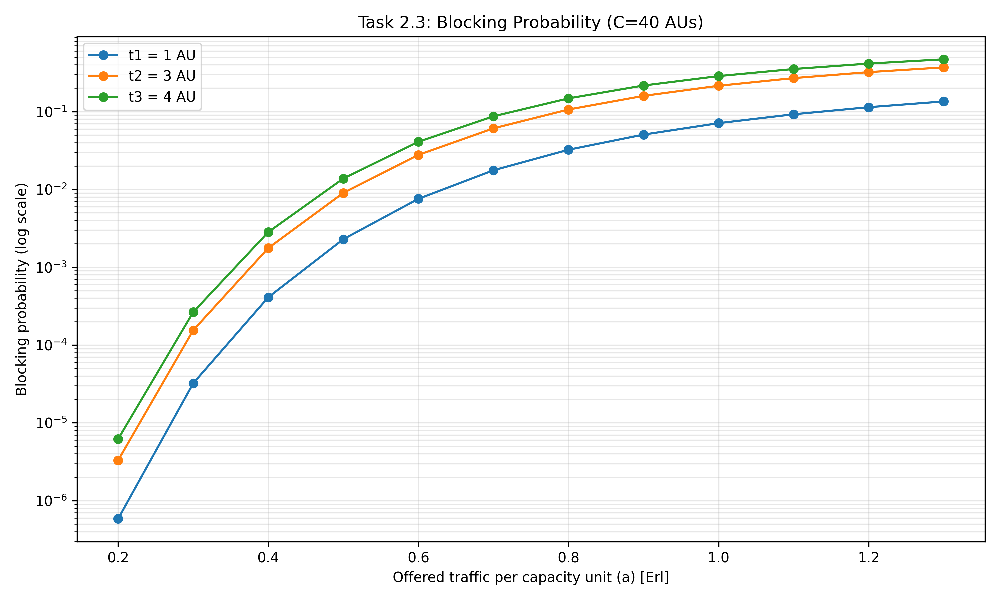

# Sprawozdanie - Laboratorium 1
## Badanie systemów pełnodostępnych z ruchem wielousługowym

### Dane wejściowe do zadania 2.2
Analiza systemu o pojemności **C = 20 AU** z dwoma klasami strumieni:
- **t₁ = 1 AU** (np. połączenia głosowe)
- **t₂ = 3 AU** (np. połączenia wideo)
- Zakres ruchu: **0.2 - 1.3 Erl**

### Dane wejściowe do zadania 2.3
Analiza systemu o pojemności **C = 40 AU** z trzema klasami strumieni:
- **t₁ = 1 AU**
- **t₂ = 3 AU**
- **t₃ = 4 AU**
- Zakres ruchu: **0.2 - 1.3 Erl**

---

## Wyniki - Zadanie 2.2

### Fragment pliku wynikowego (task_22_blocking_probabilities.txt):
```
# C = 20
#	t[1]= 1
#	t[2]= 3

a       E[t₁=1]      E[t₂=3]
0.2     0.00004109   0.00029034
0.5     0.00950275   0.04119962
1.0     0.11194515   0.33944355
1.3     0.19089390   0.50784771
```

### Wykres prawdopodobieństwa blokady:



### Obserwacje:
- Prawdopodobieństwo blokady **rośnie wykładniczo** wraz ze wzrostem ruchu
- Klasa **t₂ = 3 AU** ma **wyższe prawdopodobieństwo blokady** niż t₁ = 1 AU
- Przy a = 1.3 Erl, blokada dla t₂ przekracza **50%**

---

## Wyniki - Zadanie 2.3

### Fragment pliku wynikowego (task_23_blocking_probabilities.txt):
```
# C = 40
#	t[1]= 1
#	t[2]= 3
#	t[3]= 4

a       E[t₁=1]      E[t₂=3]      E[t₃=4]
0.2     0.00000058   0.00000330   0.00000620
0.5     0.00229057   0.00901510   0.01379729
1.0     0.07100929   0.21462803   0.28589754
1.3     0.13503650   0.36989753   0.46974261
```

### Wykres prawdopodobieństwa blokady:



### Obserwacje:
- Większa pojemność systemu (C=40) **zmniejsza prawdopodobieństwo blokady**
- Klasa **t₃ = 4 AU** ma **najwyższą blokadę** ze wszystkich klas
- Zależność: **większe t[i] → wyższa blokada**
- Dla niskich wartości ruchu (a=0.2), prawdopodobieństwo blokady < 10⁻⁵

---

## Porównanie

| Parametr | Zadanie 2.2 (C=20) | Zadanie 2.3 (C=40) |
|----------|-------------------|-------------------|
| Pojemność | 20 AU | 40 AU |
| Liczba klas | 2 | 3 |
| Blokada (a=0.5, t=1) | 0.0095 | 0.0023 |
| Blokada (a=1.0, t=3) | 0.339 | 0.215 |

**Wniosek:** Zwiększenie pojemności systemu z 20 do 40 AU **zmniejsza prawdopodobieństwo blokady ~4 razy** dla tych samych parametrów ruchu.

---
**Metodologia:** Pliki ```z*.py``` wykonane samodzielnie, główna pętla ```main.py``` wygenerowana z pomocą Claude AI.
**Source Code:** https://github.com/szymonstanek/put-lab-monitoring/tree/main/L1 
**Data:** Październik 2025
**Przedmiot:** Monitorowanie i Ocena Wydajności Sieci